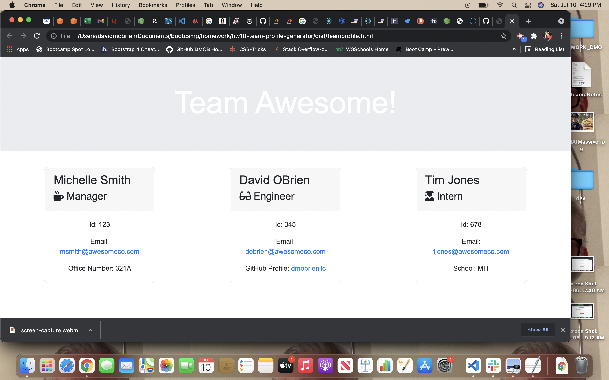

# hw10-team-profile-generator
Command line app facilitating generation of team profile

## Table of Contents
1. [General Info](#general-info)
2. [Screenshot](#screenshot)
3. [Technologies](#technologies)
4. [Usage](#usage)
5. [FAQs](#faqs)

### General Info
***
### David OBrien's Team Profile generator

inquirer (console) based application facilitating custom web presentation
of your software engineering team.

### Screenshot

## Technologies
***
A list of technologies/patterns used within the project:
  * node
  * inquirer
  * javascript
  * jest unit testing framework
  * object oriented development

## Usage
***
See link to demo video below:

Link to github repository- https://github.com/dmobrienllc/hw10-team-profile-generator

Link to Team Profile generator demo video- https://drive.google.com/file/d/1a1KW4WfZqXrNiU9wTLgz4sfcAA7_tFZZ/view?usp=sharing

## FAQs
***

Q Is this application awesome?

A Why yes it is!
---

